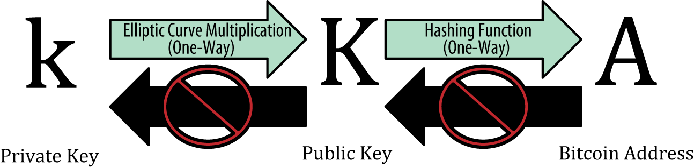
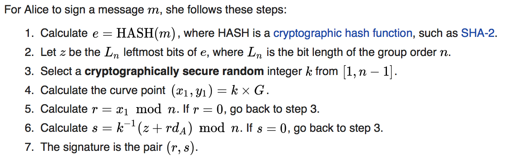
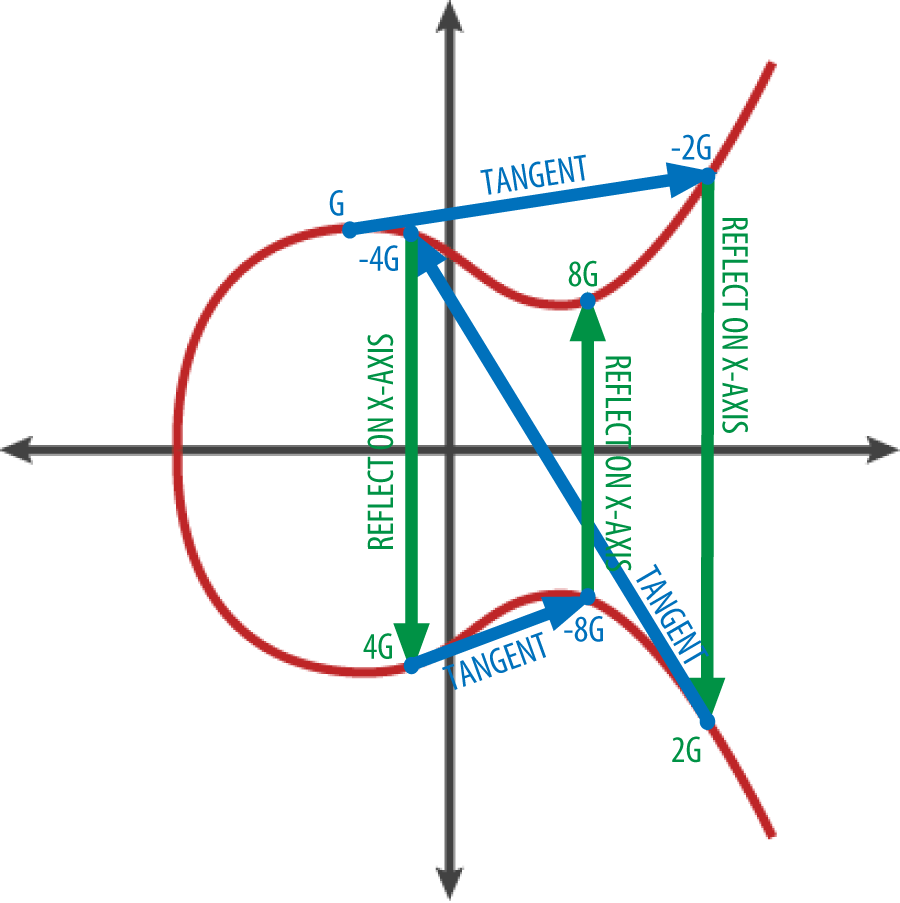
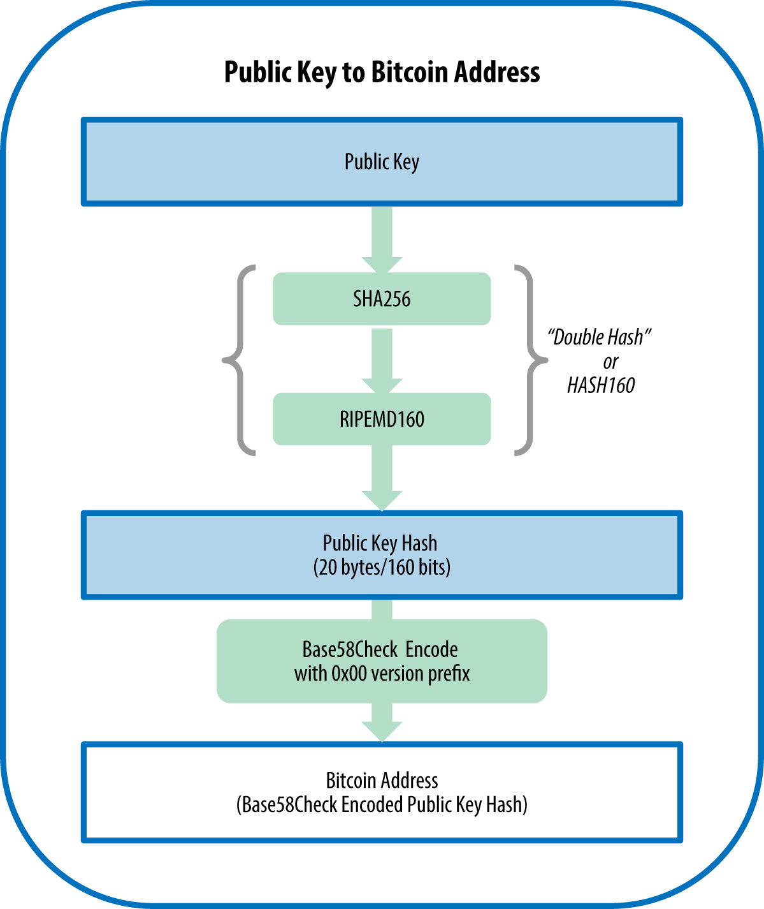
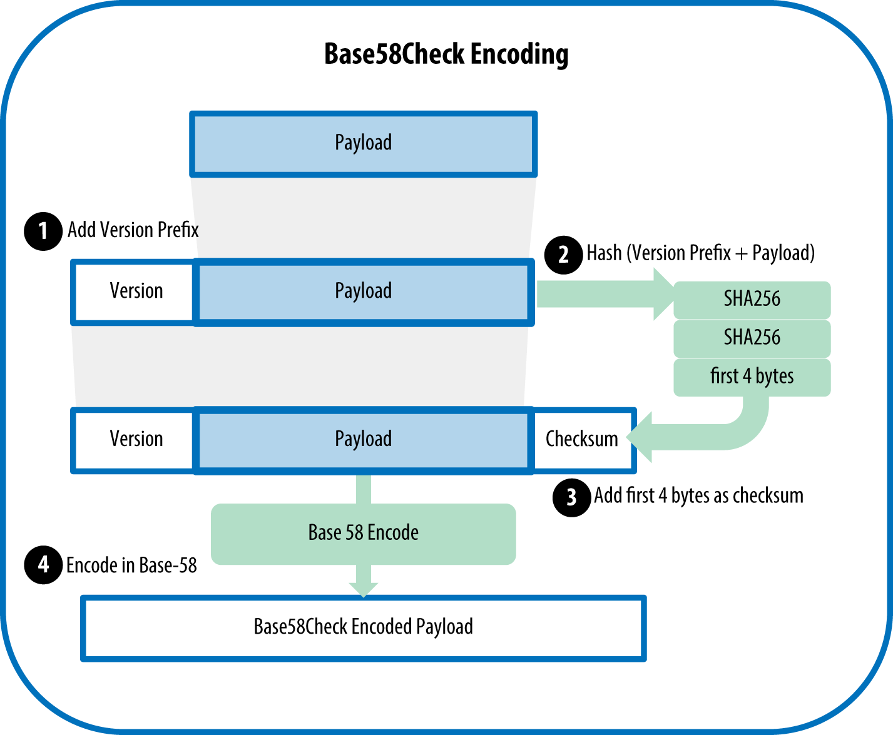
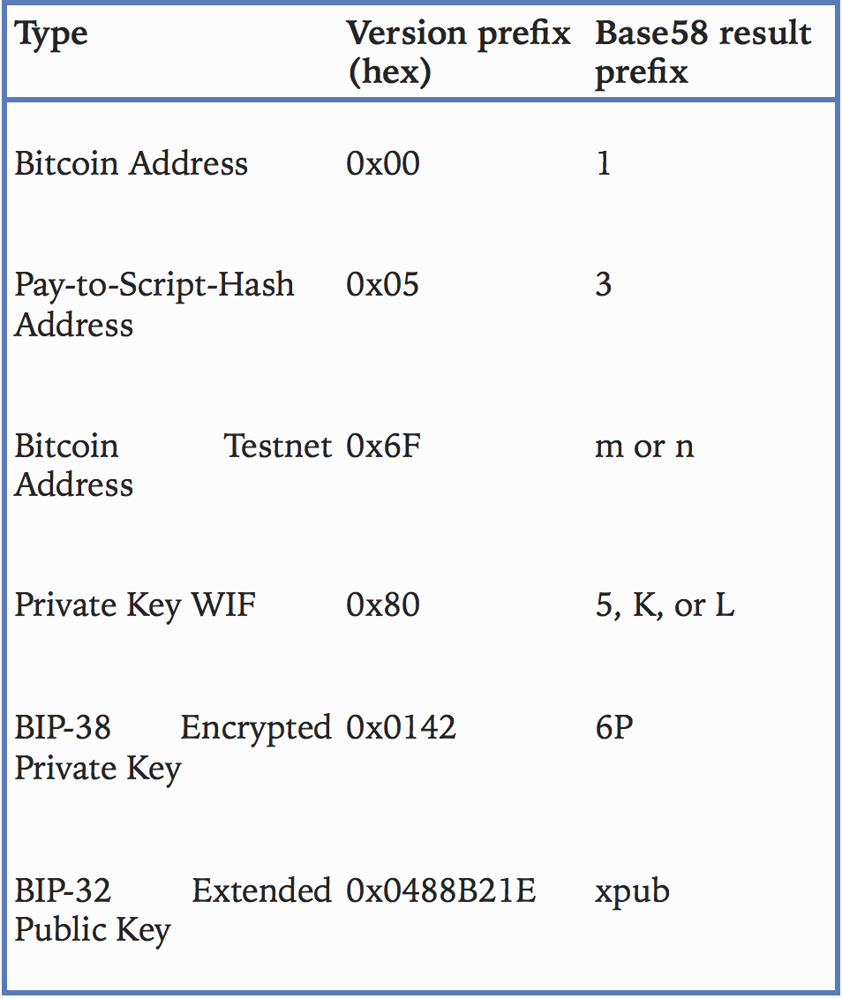
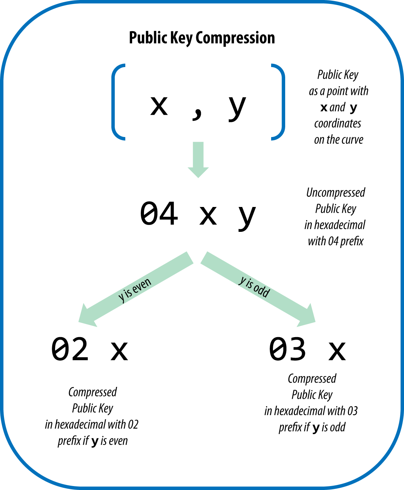

# Chapter 04
## 4.1 Intro
_What do we use keys for?_
To sign transactions
_Where keys are stored?_
Keys are stored in a local / cloud database per user discretion, called **wallet**
_How do we make transaction over the network?_
Most bitcoin transactions require a valid **digital signature** (witness) to be included in the blockchain, which can only be generated with a secret 
_How can transaction dictate the owner of the funds?_
The **witness** data in bitcoin transaction testifies to the true ownership of the funds being spent
_What are the keys stored in the wallet?_
Private & Public Keys, which are kept in the user’s wallet
_How do we represent the public key?_
A public key is represented by its digital fingerprint **(signature)**, called a bitcoin address, which is used similar to “Pay to the order of “ on a check.
_Can bitcoin address, represented things other than public keys?_
Yes, they can also represent scripts (P2SH), and multisignature recipients.
(Similar to paying, companies, or automated bills work in real life)
_So how are things are going to unfold during this chapter?_
1. Introduce crypto & explain math behind bitcoin
2. Look how keys are generated, stored and managed
3. Review various encoding formats used to represent private & public keys, addresses, and script addresses.
4. Look at advanced use of keys & addresses such as vanity, multi signature and script addresses, and paper wallets.

### Public Key Cryptography
_How do we ensure security?_
Invention of public key cryptography, brought **one-way trapdoor**  functions (easy to calculate, hard to reverse), such as elliptic curve  multiplication which is used in Bitcoin.
_How do we create & control access in bitcoin?_
Using our private key, we create a public key, derived by using a trapdoor function (elliptic multiplication curve).
_What’s the exact relationship between private and public key?_
Mathematical relationship between public key and private key that allows the private key to be used to generate signatures on messages.
	* How we use these signatures?
		* Can be validated against public key without revealing private key
	* How does it work in a transaction?
		* When spending bitcoin, owner presents a public key, and generates a new signature (from the same private key) in a transaction to spend those bitcoins.
	* How do we verify and validate transactions?
		* By presenting the public key and the signature everyone in the bitcoin network can verify and accept the transaction as valid
	* Do we have to store both keys as a key pair?
		* No, although it’s common, we can simply derive a public key from the private key, so storing the private key solely is possible.
### Private & Public Keys
_After looking at private and public keys, address, and cryptographic functions, how does everything come to play together?_

* Let’s denote private key by `k` 
* Let’s denote public key by `K` and denote one-way cryptographic, elliptic curve multiplication function by `ECM` s.t:  `K = ECM(k)` 
* Let’s denote one-way cryptographic hash function as `HASH` to generate a bitcoin address `A` s.t: `A = HASH(K)`
#### Asymmetric Cryptography
_Why use Asymmetric Cryptography?_
* To generate digital signatures:
	* Private key signature — (validated against public key without revealing private key)
		* A private key can be applied to the digital fingerprint of a transaction to produce a numerical signature — Can be produced only with the knowledge of the private key 
			* Anybody with the public key and the transaction fingerprint can use them to verify the signature
	* Public key signature — (bitcoin address) 
		* A public key can be used in one way hash to produce a bitcoin address (public key signature), and then, the private key  signature can be used along with the public key, in order to spend the bitcoins of the address
#### Private Keys
_What’s a private key?_
* A number picked at random, with control over all funds associated with the corresponding bitcoin address
::[Bitcoin: Digital signatures (video) |Khan Academy](https://www.khanacademy.org/economics-finance-domain/core-finance/money-and-banking/bitcoin/v/bitcoin-digital-signatures)::
_What’s a private key signature?_
* A hash that proves that something (transaction, in our case) was signed by the private key, and it is generated by the passing the following to a hash function:
	* Signing private key
	* Transaction (message) to be signed
_How do we verify message with it’s signature?_
* When **signature** is presented along with the **transaction** (message) and the **public key** (of whoever generated the signature), we can validate the signing action without knowing the private key (output yes / no).
_Mathematically what is the signature composed of?_
* In our case the signature is composed off two numbers:
	* r
	* s
_What’s the algorithm for signing a message with our private key (producing a private key signature)?_

* **More details in Chapter 05**
_How do we approach generating a private key from a random number?_
Find a secure source of entropy, which can pick a number, between 1 and 2^256. 
_More specifically?_ 
We randomly pick a 256-bit number and check that it’s indeed `< 2^256`
_In programming?_
It’s achieved by feeding larger string of random bits sourced by a cryptographically secure source of randomness, into a SHA256 hash algorithm, if `< 2^256` then proceed, else: try again.
_Useful commands_
1. `getnewaddress` - bitcoin address
2. `dumpprivkey` - reveal private key of bitcoin address
#### Public Keys
_How do we calculate public key using ECM?_
* Recall ECM function where `K=ECM(k)`, if we be more specific, we can say `K= k * G`, where G is a constant, called **generator point**
_Why can’t we reverse the process to determine private key?_
* Since we use ECM (one-way trapdoor function), which means using a number and multiplying it by a point on the elliptic curve, it’s very hard to calculate the k.
_What does calculating the private key actually mean when public key is generated by ECM?_
* It would mean that we can **reverse our trapdoor function**, and find the **discrete logarithm**. This is an action that can only be done by a brute-force search
### Elliptic Curve Crypto Explained
::_Let’s go over the math for a bit…_::
* Recall: Elliptic curve cryptography (multiplication included) is a type of asymmetric cryptography, 
* It is based on **discrete logarithm problem**, expressed by addition multiplication on the **points** of an **elliptic curve**
::_So what elliptic curve do we use in bitcoin?_::
In bitcoin we use a standard called  `secp256k1` which was established by the National Institute of Standards and Technology (NIST)
::_Whats the formula for Bitcoin’s elliptic curve?_::
* `y² = (x³ + 7)` or
* `y² = x³ + a * x +b mod p` where `p=2²⁵⁶-2³²-2⁹-2⁸-2⁷-2⁶-2⁴-1`
	* `mod p` indicates that this curve is over a **finite field of prime order p**, also denoted as **F𝑝**
::_What does ‘p’ define?_::
	* ‘p’ help us define a finite field  of prime order instead of over the real numbers.
	* ::_Meaning?_::
		* It help us build a pattern look-alike of dots scattered in two dimensions that we cannot envision
::_What is “point at infinity”?_::
* it is a point which roughly corresponds to the **role of zero in addition.**
::_Is there particular value it is set to?_::
* On some computers, it is sometimes represented by x = y = 0
::_Does it satisfy the elliptic curve equation (asked otherwise, **can it be a:: possible result of our equation?**)_
* No, but it’s an easy separate case that can be checked
::_What are the operators of elliptic curve cryptography?_::
* **‘+’** operator as learned in grade school
	* ::_What’s its defined purpose?_::
		* Defined by the following axiom:
			* Given two points P₁ and P₂ on the elliptic curve, there exist a third point P₃, which satisfies P₃=P₁+P₂
	* ::_How is it achieved?_:: 
		* Calculated by **drawing a line** between **P₁** and **P₂**.
			* This line has to **intersect the elliptic curve** in exactly **one additional place**, we denote this point as  P₃’= (x,y)
		* **Reflect P₃’** in the **x-axis** to get **P₃=(x, -y)**
::_Lets’s continue defining addition, by introducing the **concept of tangent line on the curve**:_::
1. If **P₁** and **P₂** are the **same point**, the line “between” **P₁** and **P₂**, **extends to be the tangent on the curve**, at the point P₁.
Using our **‘+’ operator**, between **P₁** and **P₂**, we will intersect the curve in **exactly one** new point **(P₃’)**
::_What are the special cases that explain the need for the “point at infinity”, when using ‘+’ operator?_::
2. If **P₁** and **P₂** have the same x values but different y values, the **tangent line** will be **exactly vertical**, in which case P₃, doesn’t exist on the curve, hence it’s a **point at infinity** _(Basically assuming P₂=-P₁, then P₁ + P₂ = 0)_ 
3. If P₁ is the **“point at infinity”**, then P₁+P₂ = P₂, similarly if P₂ is **“point at infinity”**, then P₁+P₂ = P₁ (point at infinity plays the role of zero)
::_What else should be done to finish defining addition?_::
4.  Defining **associative addition**
(A + B) + C = A + (B + C)
::_Given the properties we defined above, how can we use addition to define multiplication?_::
* Using the **associative addition property**, we extend addition as such:
For a point P on the elliptic curve, if k is a whole number, then **kP = P + P + P + … + P (k times)** 

#### Generating a Public Key
_How do we generate public keys using Elliptic Curve cryptography?_
* Using our private key, in the form of **randomly generated number (k)** , we **multiply** it by a **predetermined point** on the curve called the **generator point**, G to produce another point somewhere else on the curve, which is corresponding to public key K.
_Why can we ensure that k * G will always produce the same key K?_
* The generator point is always the same for all bitcoin users
_Can k be calculated backward from K?_
* Since ECM is a function used to find to solve a discrete logarithm problem, the relationship between k & K is fixed and defined in a logarithmic manner.However, it can only be calculated in one direction, from k to K, thus, k is never revealed through K.
* Simply put we never defined any sort of fixed division property for ECM, so there’s no way back.

::How can we look at multiplication visually?::
* which basically means:
	1. drawing a tangent line to a certain point (since G + G simply means finding the tangent line to G, 
	2. finding where it intersects the curve only once **with** the **correct slope** (±2G)
	3. and then reflecting that point on the x-axis to get the correct point which we repeat the process on.
* repeat this **(log k)** times, according to K = k * G

## 4.2 Bitcoin Addresses
_What’s a bitcoin address?_
* Bitcoin address is what appears most commonly in a transaction as the “recipient” of the funds
_Recall: How’s bitcoin address derived?_
Derived from the public key through the use of one-way cryptographic hashing.
_What’s a hash algorithm?_
A one-way function that produces a fingerprint or “hash” of an arbitrary-sized input (can take input of any size and will always produce same length output)
_Where are the areas that use cryptographic hash functions in bitcoin?_
* Generating bitcoin addresses
* Generating script addresses 
* Mining by using Proof-of-Work the algorithm, we hash the different blocks and the buffer data
_Let’s focus on generating bitcoin address, what do algorithms, do we use to generate hash?_
* one-way SHA256 on the public key K
* RIPEMD160 on the result
**producing a 160-bit (20-byte) number ‘A’**
_Whats the size of an unencoded bitcoin address?_
20-bytes, however, we usually present addresses in a Base58Check, which is larger
_So how are bitcoin address represented (format)?_
* Bitcoin addresses are almost always encoded as **“Base58Check”**
#### Base58 and Base58Check Encoding
_What’s Base58 and Base58Check?_
* Base58 is an encoding which uses 58 characters to represent bitcoin addresses.
* Base58Check is similar to Base58, but offers an additional checksum component to help human readability, avoid ambiguity, and protect against errors in address transcription and entry.
_Where else Base58Check is used when transcribing a number?_
* A private key
* An encrypted key
* script hash
_Give me an overview on transcoding a public key into bitcoin address_

_What are possible alphabets for Bitcoin’s Base58?_
* Base58 is simply Base64 without the 0 (number zero), O (capital o), l (lower L), I (capital i), and the symbols ‘+’, and ‘/‘
_How does the checksum work?_
* The decoding software will calculate the checksum of the data and compare it to the checksum included in the code.
If the two do not match, an error has bee introduced and the Base58Check data is invalid.
_How do we convert a number into Base58Check format?_
* Type: We first add a **prefix** to the data, called the “version byte”, which serves to easily identify the type of data that is encoded
* Next, calculate the double-hash 32-byte (256-bit) checksum `checksum(prefix, data) = SHA256(SHA256(prefix+data))`
	_Where do we find the checksum code?_
	* First four-bytes (32-bits) of the double-hash
	_How do we prepare the data for Base58Check encoding?_
	* `prefix+Base58CheckEncode(data)+checksum`
	 _What’s the size of the Base58Check bitcoin address?_
	* **25-byte**:
		* 1-byte version prefix,
		* 20-byte RIPEMD160 raw bitcoin address,
		* 4 byte checksum made by concatenating and double-hashing the prefix, and the raw bitcoin address

* Recall: we use Base58Check formatting for different purposes (address, private key, etc…), and differentiate between them by adding specific version prefixes in the beginning of each address.

What are some of the prefixes?

### Key Formats
#### Private key formats
_What’s the size of a private key and and common formats of representation?_
* Private keys are mainly represented in 3 different formats, all of which correspond to the same 32-byte (256-bit) number.
	* Hexadecimal
	* Raw binary
	* WIF
		* Compressed
_How do we indicate a specific format?_
* Just like with public keys, we assign different prefixes:
	* Raw: 32 byte string without prefix
	* Hex: 64 hex digits without prefix
	* WIF: Base58 encoded string with prefix `5` (`128`) and 32-bit checksum
	* WIF compressed: Base58 encoded string as mentioned above with prefix `K` or `L` (`128`) with an added suffix 0x01 before encoding
_Can the formats be interchanged between each other?_
All of the representations are different ways of showing the same private key, and they can easily be converted to one another.
_What command can be used to convert between WIF and raw binary (elliptic curve private key point)?_
`bx wif-to-ec` which is a part of the bitcoin explorer command line suite
#### Decode from Base58Check
_How do we decode a base58check string (keys, addresses, and transactions)?_
* Using the suite mentioned above:
`bx base58check-decode`  can decode the uncompressed key.
* The result contains the key as payload (key data), the WIF version prefix `128`, and a checksum.
* If the payload of the compressed key is **appended with the suffix** `01`  if the **public key is to be compressed** 
#### Encode from hex to Base58Check
_How do we perform the reverse process of encoding to Base58Check?_
* When converting from hex (64 digits), we are talking about converting a private key, to do so we need:
	* provide a private key hex
	* followed by the WIF version prefix `128`
This data should be passed to `bx base58check-encode`
#### Encode from hex (compressed) to Base58Check
_How do we encode as  a “compressed” key?_
* Append the **suffix** `01` to the hex key and then encode as in the preceding section
	* WIF-compressed format starts with a `K`
### Public key formats
::Now let’s focus more on the technicalities of the different public key formats…::
_Are there also different formats for public keys?_
* Public keys are also presented in different ways, usually as either compressed or uncompressed public keys
_Recall: What’s a public key?_
A point on the elliptic curve consisting of a pair of coordinates (x,y)
_How’s it represented in a hexadecimal form?_
Usually presented with the **prefix** `04`, followed by two 256-bit numbers: 
* one for the 𝒙 coordinate of the point
* other for the 𝑦 coordinate of the point
_How do we distinguish and present uncompressed public keys?_
* Prefix is used to distinguish uncompressed public keys from compressed public keys that begin with a `02` or a `03`
_So what’s the size of our resulting public key?_
* 32-bytes (256-bit numbers) or 64 hexadecimal digits for each of the coordinate (x,y) means that we have **128 digits** relating to the data
* 1-byte (8-bit) or 2 hexadecimal digits to distinguish the prefix
* In total we are looking at **130 hex digits (520-bit number)** which we use to present our uncompressed public keys
#### Compressed public keys
::Idea: omit a certain value and recalculate it::
_Recall some of the required components of transactions_
As we know most transactions include the following:
	* public key (520-bits = prefix + x + y)
	* sender’s private key signature which 
These are **required to validate the owner’s credentials and spend the bitcoin**. 
_Why did we start compressing public keys?_
Ultimately: To reduce size of transactions (UTXOs - in RAM mempool) and reduce disk space on nodes.
* Each pub key requires 520 bits meaning that when multiplied by several hundred transactions per block, it adds a significant amount of data to the blockchain
_When compressed, what do we actually store?_
* Public key is essentially a point (x,y) on the elliptic curve, and the curve is mathematical function.
* **We can solve for y, when only x is available: y² mod p = (x³+7)**
Therefore y isn’t required. This is an almost 50% reduction in size (256-bits off)
* We add a prefix of `02` or a `03` instead of `04` to signify the use of compression
_Why do we have two options (02,03) for our prefix?_
Since we solve y² mod p = (x³+7) using x, **we get two solution, ±y.**
Visually, we mean to say that the resulting y coordinate can be:
	* **y:** above the x-axis
	* **-y:**below the x-axis
**Therefore we have to use the prefix to store the sign of y, when compressed**
_Why do we use an unsigned prefix?_
* When calculating the elliptic curve in binary arithmetic on the finite field of prime order p, the y coordinate is either even or odd, which corresponds to the positive/negative sign as explained earlier.
	* y is even = `02`
	* y is odd = `03`

_Do compressed public keys have different private key?_
No, they’re generated from the same private key
_And what about the bitcoin address?_
When performing the double hash function `RIPEMD160(SHA256(K))` it will **produce a different bitcoin address.** However, both are generated and controlled by the same private key.
_How can the wallet know what type of keys to scan for? Compressed or uncompressed?_
1. The WIF that is used to represent the private keys is implemented different in newer bitcoin wallets,
2. This indicate that these private keys have been used to produce compressed public keys
3. This ultimately produces compressed bitcoin adresses
#### Compressed private keys
::Fun fact:::
::WIF-compressed private keys are one byte longer than an "uncompressed” private key::
_Why are they longer?_
Because they have an added one-byte suffix which signifies that the private key is from a newer wallet, and should only produce compressed public keys.
_So are these private keys actually compressed?_
No, and they cannot be compressed, because all the data they contain is necessary in order to produce public key and be used further.
_So what does it mean to have a compressed private key?_
It is a private key from which only compressed public keys should be derived, and the same applies for “uncompressed” private keys, they can only produce “uncompressed” public keys.
_Although WIF-compressed private keys are longer by 1 byte, why are the Base58 equivalent is of the same length (**’5’ uncompressed, compared to ‘K’/‘L’ compressed**)?_
* Think of this difference, as between decimals such as 100 and 99. Yes, 100 is one digit longer, but also it has prefix of ‘1’ instead of ‘9’.
* Similarly In Base58, the prefix `5` changes to a `K` or `L` as the length of the number increases by one byte
_What happens when exporting private key from a new wallet?_
* When exporting keys from a new wallet that implements compressed public keys, the WIF is modified, with the addition of a one-byte suffix `01` to the private key. 
* This is called “compressed WIF” and starts with the letter `K` or `L`, instead of starting with `5` (noncompressed / WIF-encoded) like keys from older wallets

## 4.3 Implementing Keys and Address in Python
**Look at the code**
## 4.4 Advanced Keys and Addresses
### Encrypted Private Keys (BIP-38) - Encryption for Paper wallets
_What’s the motivation behind encrypting private keys?_
Private keys must remain secret. However, it’s difficult to achieve _confidentiality_ (secure) while keeping the _availability_ (portable). BIP-38 standard solves this issue
_What does BIP-38 propose?_
A common standard for encrypting private keys with passphrase and encoding them with Base58Check so that they can be stored securely on backup media, or transported securely between wallets.
_What encryption does BIP-38 use?_
AES, Advanced Encryption Standard (established by NIST)
_How does BIP-38 work?_
* It takes bitcoin private key as an input, usually encoded in the WIF, as a Base58Check string with the prefix of `5`
* A passphrase - long password - usually composed of several words or a complex string of alphanumeric characters.
_What’s the result of BIP-38 encryption scheme?_
A Base58Check encoded encrypted private key that begins with the prefix `6P`, which indicates that it requires a passphrase in order to convert (decrypt) it back into a WIF-formatted private key (prefix `5`) that can be used in any wallet.
_What’s the most common use case for BIP-38 encrypted keys?_
Paper wallets that are used to back up private keys on a piece of paper. (Cold storage — offline bitcoin storage)
### Pay-to-Script Hash (P2SH) & Multisig Addresses
_How do we recognize P2SH addresses?_
They begin with the number `3`, pay attention: they are **NOT** multi signature addresses.
_What’s the difference between P2SH and multisignature?_
P2SH address might often represent multi-signature script, but it might be a script encoding of  different transaction kind
_Who collects P2SH benefits?_
P2SH designates the beneficiary of a bitcoin transaction as the hash of a script, instead of the owner of a public key. The feature was introduced in January 2012 with BIP-16
_How “regular” P2PKH collect compared to P2SH?_
* P2PKH proof of ownership requires presenting:
	1. Public key hash (paid to public key hash — bitcoin address derived from hash of public key)
	2. Private key signature (Hash made of message and private key of payer)
_How do we create a P2SH address?_
It involves the same double-hash function as used during creation of bitcoin address, only applied on the script instead of the public key:
`hash=RIPEMD160(SHA256(script))`

#### Multisig addresses & P2SH
_What’s the most common P2SH?_
As mentioned above, often P2SH function is representing a multi signature address script (due to the smaller foot print as seen later in Chapter 7)
_What’s unique about multi signature addresses (What is it all about)?_
The multisignature feature is designed to require M signatures from a total of N keys, known as M-of-N multisignature, where M is equal to or less than N
_What is multi signature address in simple words?_
Similar to the implementation of “joint account” in traditional banking
### Vanity Addresses
#### Generating vanity addresses
#### Vanity address security
### Paper Wallets

