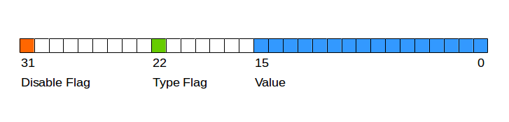

# Chapter 7
#mastering-bitcoin
## 7.2 Multisignature
_What is it?_ M-of-N signatures used in order to spend UTXOs made to the Multisignature pay script. M <= N 
_How to use?_
		1. Unlocking script: `SIG1 SIG2`
		2. Locking script: `2 <Mohammed's Public Key> <Partner1 Public Key> <Partner2 Public Key> <Partner3 Public Key> <Attorney Public Key> 5 CHECKMULTISIG`
		* Notice how the **M** is at the prefix of the locking script and the **N** is stated right before the CHECKMULTISIG flag
_Bug_: Checkmultisign pops an extra item, so we need to add a buffer number as a prefix to the unlocking script
## 7.3 P2SH (Pay-to-Script-Hash)
_Why?_ 🤔Complex scripts are harder to process (transaction cost goes up), they require special wallet software to be carried on.
_How do we solve this?_ 💡 Find a way to compress (hash) the transaction into a simple signature that users can pay to
	1. SHA256
	2. RIPEMD160
_Code example_ 
	1. Hash redeem script as stated above:
		* `<Sig1> <Sig2> <2 PK1 PK2 PK3 PK4 PK5 5 CHECKMULTISIG>`
	2. Usage: `HASH160 <redeemScriptHash> EQUAL`
	3. To unlock spending for the UTXOs made to our P2SH, combine as following:
		1. Locking Script: `<2 PK1 PK2 PK3 PK4 PK5 5 CHECKMULTISIG> HASH160 <redeem scriptHash> EQUAL`
		2. Unlocking `<Sig1> <Sig2>`
**_What’s redeeming script?_**
Has similar functionality to a P2PKH script. One copy is hashed to create a P2SH address. The other copy is placed in the spending signature script to enforce it’s conditions.
	* **How’s it different from locking and / or unlocking scripts?**
		* Locking and unlocking scripts are used to set lock conditions and unlock transactions. Redeem script is a method of shortening the format of complex locking scripts into a hash of 160 bytes
_More things to know?_
* Version prefix is ‘5’ so  Base58Encoding  **prefix** is  `3`
* Not recursive, can’t put P2SH script inside of P2SH redeem script
_Benefits?_
* Complex scripts are replaced by shorter fingerprints in the transaction output, making the transaction smaller.
* Scripts can be coded as an address, so the sender and the sender’s wallet don’t need complex engineering to implement P2SH.
* P2SH shifts the burden of constructing the script to the recipient, not the sender.
* P2SH shifts the burden in data storage for the long script from the output (which is in the UTXO set) to the input (stored on the blockchain).
* P2SH shifts the burden in data storage for the long script from the present time (payment) to a future time (when it is spent).
* P2SH shifts the transaction fee cost of a long script from the sender to the recipient, who has to include the long redeem script to spend it.
## 7.4 Data Recording Output (RETURN)
_Idea:_ Type of output that records arbitrary data into blockchain without writing to UTXOs memory pool and wasting RAM
_Usage:_
Through CLI using “datacarrier”, and “datacarriersize” 
_Limitations:_ 
	1. 80 bytes (83 total - 80 for RETURN data, 1 byte RETURN OP CODE, 2 byte PUSHDATA OP Code)
	2. No unlocking script to “spend” a RETURN output
	3. If a RETURN is  referenced as an input in a transaction, the script validation engine will halt, and mark the transaction invalid
_How’s it different from “fake” UTXO?_
1. The RETURN operator creates an explicitly **provably unspendable** output, consumes hard disk space and not RAM
2. Halts if used as an input, unlike a fake UTXO

## 7.5 Timelocks
_Idea:_ Introduce the concept of time into bitcoin, and use it in transactions

_Tools:_
* CLI:
	1.  CHECKLOCKTIMEVERIFY
	2. CHECKSEQUENCEVERIFY
* Transaction:
	1. nLocktime field - transmitted to the network only after they become valid, like postdating a paper check.

_Gotchas:_
* nLocktime < 500 million, then nLocktime is block height
* nLocktime >= 500 million, then nLocktime is Unix Epoch timestamp

_Limitations:_
nTimelock doesn’t prevent from spender to double-spend the same inputs without a lock time. Meaning that a lock time transaction could be made, but its funds could be spent by the originator without knowing.

_How do we solve it?_
Place timelock restriction on  UTXO itself and be part of the locking script, instead of on transaction. Use **Check Lock Time Verify** CLTV

### Check Lock Time Verify, CLTV
**Introduced in BIP-65**
_How does it work?_
* By adding the CLTV opcode in the redeem script of an output it restricts the output, so that it can only be spent after the specified time has elapsed.

* For example, if Alice locks the output of the transaction with CLTV, and makes an nLocktime transaction to Bob. The output of the transaction is currently locked.

_Remember:_
* CLTV doesn’t replace nLocktime, but rather restricts specific UTXO, such that they can only be spent in future transaction with nLocktime set to greater or equal value

_How to use?_
1. Typical P2PKH:
	* DUP HASH160 <Bob's Public Key Hash> EQUALVERIFY CHECKSIG
2. P2SH transaction with following redeem script:
	* <time> CHECKLOCKTIMEVERIFY DROP DUP HASH160 <Public Key Hash> EQUALVERIFY CHECKSIG

* Where <time> is current block height + 12,960 (blocks) or current Unix epoch time + 7,760,000 (seconds). Or 90d
	* **Format must match for CLTV and nLocktime**
* If the CHECKLOCKTIMEVERIFY set by the input transaction, is less than or equal to the spending transaction’s nLocktime, script execution continues. Otherwise, it halts as it should.

_When does the execution usually halt?_
1. the stack is empty; or
2. the top item on the stack is less than 0; or
3. the lock-time type (height versus timestamp) of the top stack item and the nLocktime field are not the same; or
4. the top stack item is greater than the transaction’s nLocktime field; or
5. the nSequence field of the input is 0xffffffff.

_Whats the use of DROP opcode?_
* If CLTV is satisfied, the time parameter remains as the the top item on the stock, and may need to be dropped, with DROP.

_Why do we use CLTV with nLocktime?_
nLocktime is set on the transaction itself, while CLTV is set on the output, if we lock both correctly, we can ensure that double-spending wouldn’t occur by the payer, and also ensure that the payee wouldn’t be able to use the UTXO before the specified time

### Relative Timelocks

Specify a condition of spending an output, as an elapsed time from the confirmation of the output in the blockchain

_What is it used for?_
* Two or more independent transactions can be held off chain, while imposing a time constraint on one transaction that is dependent on the elapsed time from the confirmation of a previous transaction.
* Bidirectional state channels, and Lightning Networks.

_How is it implemented?_
Made to specifications in BIP-68 AND BIP-112
Using transaction-level feature (nSequence), and a script-level opcode (CHECKSEQUENCEVERIFY - CSV)

_How do we use nSequence with nLocktime or CLTV?_
* nSequence must be set to < 2^32, usually set to 2^32 - 1
* When most significant isn’t set (bit 1 << 31 isn’t set), it is a flag that means “relative locktime”.
* But, when bit 1 << 31, the nSequence value is reserved for other uses such as enabling CHECKLOCKTIMEVERIFY, nLocktime.
* Since nSequence is per-input field, it may contain a number of time locked inputs, all of which need to be aged, in order for the transaction to be valid.
* Due to the mentioned above, some field can be relative time locked (nSequence < 2^31), while others are absolute time locked  (nSequence >= 2^31)

_How do specific the value of nSequence?_
* Can be specified in seconds, or in blocks, but we need to specify the **type-flag** in the 23rd least significant bit.
	* If it is set, then the nSequence value is interpreted as a multiple of 512 seconds
* Only 16 least significant bits are considered when nSequence interpreted as a relative timelock (masked with a 16-bit mask)



_How do we relatively, time lock transactions?_
* Using nSequence and CHECKSEQUENCEVERIFY - CSV, just like we did with nLocktime and CLTV
	* The formats must match and nSequence(time) >= CHECKSEQUENCEVERIFY(time)
_How do we calculate time in a decentralized network, where each node has its own perspective?_
* **Median-Time-Past**
_How does Median-Time-Past work?_
1. Taking the timestamps of the last 11 blocks (~2 hrs = 10 minutes for each block) and finding the median.
_How can we use timelocks to prevent, deter miners from mining older blocks for profit and rewriting the past?_
* Bitcoin Core sets the nLocktime to  <Current block + 1>, and, nSequence on all the inputs to 0xFFFFFFFE to enable nLocktime. This way only transaction that were valid at the time and already mined can be remind, so no fees are gained.

## 7.6 Scripts with Flow Control (Conditional Clauses)
Implemented using the following opcodes:
_Basic:_
1. IF
2. ELSE
3. ENDIF
4. NOTIF
_Bool:_
6. BOOLAND
7. BOOLOR
8. NOT

_Template:_
```
condition
IF
  code to run when condition is true
ELSE
  code to run when condition is false
ENDIF
code to run in either case
```

_Guard operation:_
* Example With EQUALVERIFY (**doesn’t leave the result on the stack, like other VERIFY**): 
```
HASH160 <expected hash>
EQUALVERIFY 
<Bob's Pubkey> CHECKSIG
```
* Example With EQUAL IF:
```
HASH160 <expected hash> EQUAL
IF
   <Bob's Pubkey> CHECKSIG
ENDIF
```
### Using Flow Control in Scripts
Notice how there’s no condition prior to the “IF”
```
IF
 <Alice's Pubkey> CHECKSIG
ELSE
 <Bob's Pubkey> CHECKSIG
ENDIF
```

The `IF` will be given the condition for execution in the unlocking script.
Meaning, if the unlocking script is: `<Pubkey> 1`, we evaluate to TRUE, and execute the `IF` part, otherwise, when we execute `<Pubkey> 0`, it is evaluated as FALSE, and we will execute the `ELSE`

```
<Redeem script goes here>
IF
  IF
	// Requires 2 out of 3 keys
    2
  ELSE
	// checks if output is 30 days old since the creation of the UTXO since the mining, requireing the lawyer's signature and requiring one partner
    <30 days> CHECKSEQUENCEVERIFY DROP
    <Abdul the Lawyer's Pubkey> CHECKSIGVERIFY
    1
  ENDIF
// Passes the values above to check the multisig
  <Mohammed's Pubkey> <Saeed's Pubkey> <Zaira's Pubkey> 3 CHECKMULTISIG
ELSE
//  
  <90 days> CHECKSEQUENCEVERIFY DROP
  <Abdul the Lawyer's Pubkey> CHECKSIG
ENDIF
```
_Answers to end of chapter:_
1. Can’t if 90 days haven’t passed yet because of CHECKSEQUENCEVERIFY
2. For 5 days only partners can unlock so 1; For 35 days, 2 partners or 1 partner with lawyer can unlock so 3; For 105 days all paths can be executed
3. No, if 2/3 partners choose to spend it is still possible. The answer doesn’t change after 91 days
4. They can simply take UTXOs and add another nSequence field to them after 29 or 89 days
5. Because Verify is used as a guard statement where we need to halt execution at, while other places do not need to end execution. 